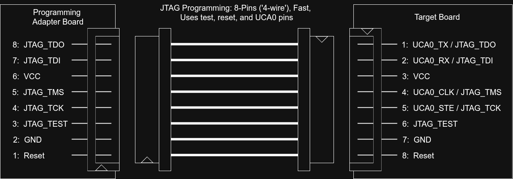
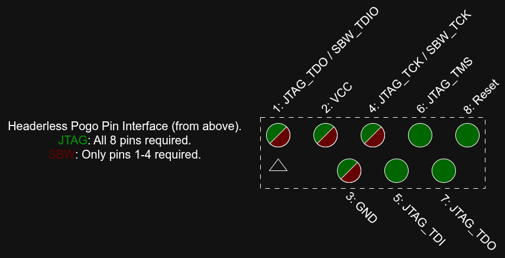

# MSP430 Programming Adapter PCB

This project converts the MSP430's quite frankly ridiculously large (and mostly unpopulated) 14-pin 2.54mm JTAG connector into much smaller footprint connectors.

The MSP430 supports two programming interfaces, JTAG and SBW: JTAG requires 8 pins overall (4 GPIO - the UCA0 pins), whereas SBW requires only 4 pins (0 GPIO). JTAG is significantly faster than SBW. SBW can struggle if the capacitance on the reset pin is too large (and the datasheet recommends a capacitor on the reset pin!).

Both JTAG and SBW options are provided in both picoblade and pico-clasp connectors. Pico-clasp connectors are easy to attach / detach due to the latch and have a finer pitch than picoblade (1mm vs 1.25mm), but are taller. Picoblade connectors have a limited number of mating cycles due to being a friction-fit and are liable to be damaged during removal but require less vertical space than pico-clasp.

A headerless programming option is also available as a 4- or 8-pin pogo pin interface. These are significantly smaller than even the picoblade or pico-clasp connectors, but are much more fragile, and must be somehow attached to the board during programming.

# Important Note - Pin Numberings
Because a connector must be rotated 180 degrees to mate with itself, the pin numbering on either side of the connectors differ - e.g. on the 8-pin connectors pin 1 is connected to pin 8 on the other side, and so on. An image is provided that shows both the pin numbering on the programming adapter board (this PCB) and the target board. If you are planning to use this adapter board you should use the target board pinout.

## JTAG Pinout

## SBW Pinout

## Pogo Pin Pinout

